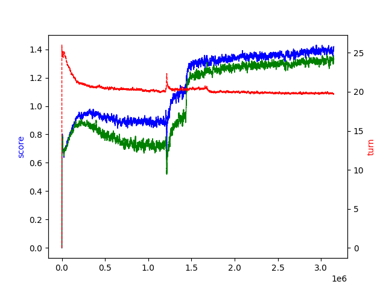

# gizmos-web

This project aims to implement a **Gizmos** (board game) environment and train RL models capable of outperforming humans in this game.

## Targets

- [x] an environment in TypeScript (for client simulation)
- [x] an environment in Python (for training)
- [x] a web client with simple UI
- [x] a web server
- [x] a competitive AI model
- [x] play with AI
- [ ] an AI better than me
- [ ] new world (let AI tell me how to play this game)

## Working on

- eliminate environment bugs
- improve environment performance
- improve training methods
- train more

## Current AI training progress



A TD3 model which has played 2-player game with itself over 3,000,000 times.

- The blue line represents the first player average points per turn
- The green line represents the second player average points per turn
- The red line represents the number of turns when game over

We reward the model in each game mainly by:

- winning or losing
- average points per turn (greater is better)
- number of turns (less is better)

## Client demo

WIP

## Want to try?

### Prepare

NodeJS >= 16
Python >= 3.10

```bash
pnpm install
cd packages/gizmos-env
pnpm run build
```

```bash
# (optional) want to use python server
cd py
pip install -r requirements.txt
```

### Terminal 1 (server)

```bash
# node server
cd server
pnpm run start
```

or

```bash
# python server
cd py
py server.py
```

### Terminal 2 (client)

```bash
# dev mode
cd client
pnpm run dev
```

or

```bash
# preview mode
cd client
pnpm run build
pnpm run preview
```

### Terminal 3 (AI) *Optional*

You must have trained an AI model using our codebase.

```bash
cd py
py sample_client.py

> login [player name]
> ready
```

## Source code

### project structure

```text
  .
  ├── client (web client)
  ├── server (web server in TypeScript)
  ├── packages/
  │   └── gizmos-env (environment in TypeScript)
  └── py/
      ├── env (environment in Python)
      ├── server.py (web server in Python)
      ├── ai_2p (models for 2-player game)/
      │   ├── ppo (*deprecated*)
      │   ├── td3 (*deprecated*)
      │   └── td3_same_agent (same model for first and second player)
      └── sample_client.py (use AI model as game player)
```
